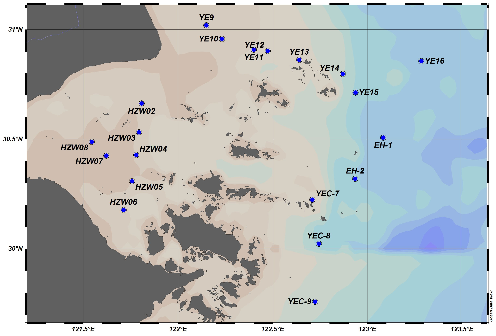

The full name of this scientific expedition is: "2023 Summer Marine Geological National Key Laboratory KPP-YEC Scientific Expedition (Key Processes-to-Products in the Yangtze River-Estuary-East China Sea Continuum) (Comprehensive Research Expedition on the Relationship between Key Processes and Products in the Yangtze River-Estuary-East China Sea Continuum)", carried out by the "Bohai Ke" scientific research vessel of the Zhoushan Bohai Marine Science and Technology Co., Ltd. in Zhejiang Province, which participated in the implementation of this survey mission.

\| Station Name | Arrival Time | Departure Time | Actual Station Coordinates (Longitude, Latitude) | Depth (m, Depth Finder) |

\|--------------|--------------|----------------|-------------------------------------------------|-------------------------|

\| \*\*August 17\*\* | | | | |

\| YEC-10       | 13:35        | 14:26          | 122°35′11.8106″E 29°37′5.3480″N                | 34                      |

\| YEC-9        | 15:39        | 16:32          | 122°43′25.0552″E 29°45′31.6238″N               | 42                      |

\| YEC-8        | 18:18        | 18:30          | 122°44′35.872″E 30°01′23.3487″N                | 37.5                    |

\| \*\*August 18\*\* | | | | |

\| YEC-7        | 05:00        |                | 122°42′34.3784″E 30°13′28.2784″N               | 27.8                    |

\| EH-1         | 12:07        | 12:34          | 123°05′01.82″E 30°30′26.848″N                  | 57.83                   |

\| EH-2         | 13:55        | 16:38          | 122°56′08.8753″E 30°19′11.1077″N               | 49.46                   |

\| YE16         | 19:57        |                | 123°17′06.4516″E 30°51′21.8359″N               | 59.41                   |

\| \*\*August 19\*\* | | | | |

\| YE16         |              | 10:09          | 123°14′46.3929″E 30°39′31.31″N                 | 58.80                   |

\| YE15         | 11:43        | 12:05          | 122°56′14.0734″E 30°42′46.5382″N               | 43.97                   |

\| YE14         | 12:45        | 13:18          | 122°52′12.4233″E 30°47′53.9436″N               | 27.00                   |

\| YE13         | 14:27        | 14:44          | 122°38′21.6125″E 30°51′42.6935″N               | 26.10                   |

\| YE12         | 15:39        |                | 122°28′23.8281″E 30°54′00.1069″N               | 13.72                   |

\| \*\*August 20\*\* | | | | |

\| YE12         |              |                | 122°28′14.3895″E 30°53′58.2565″N               | 13.74                   |

\| \*\*August 21\*\* | | | | |

\| YE12         | 08:00        |                | 122°28′20.0600″E 30°54′00.8360″N               | 12.94                   |

\| YE11         | 09:00        |                | 122°24′01.2633″E 30°54′30.5880″N               | 11.15                   |

\| YE10         | 10:04        | 10:22          | 122°13′54.2941″E 30°57′26.2128″N               | 8.20                    |

\| YE9          | 10:47        | 10:55          | 122°08′57.9205″E 31°01′08.1838″N               | 7.07                    |

\| HZW02        | 15:17        | 15:36          | 121°48′25.5355″E 30°39′46.1351″N               | 11.75                   |

\| HZW03        | 16:26        | 16:40          | 121°47′37.9945″E 30°31′53.2375″N               | 9.84                    |

\| HZW04        | 17:15        | 17:38          | 121°46′46.4440″E 30°25′40.6562″N               | 11.91                   |

\| HZW05        | 18:19        | 18:33          | 121°45′20.0149″E 30°18′31.6843″N               | 10.55                   |

\| HZW06        | 19:17        | 19:33          | 121°42′47.0560″E 30°10′37.0653″N               | 6.23                    |

\| \*\*August 22\*\* | | | | |

\| HZW08        | 14:19        | 14:30          | 121°32′38.5748″E 30°29′18.1459″N               | 9.87                    |

\| HZW07        | 15:08        | 15:21          | 121°37′18.0660″E 30°25′32.0412″N               | Discontinued           |

I participated in the scientific expedition voyages before August 20th.
